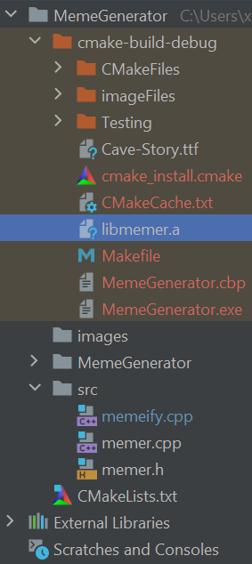
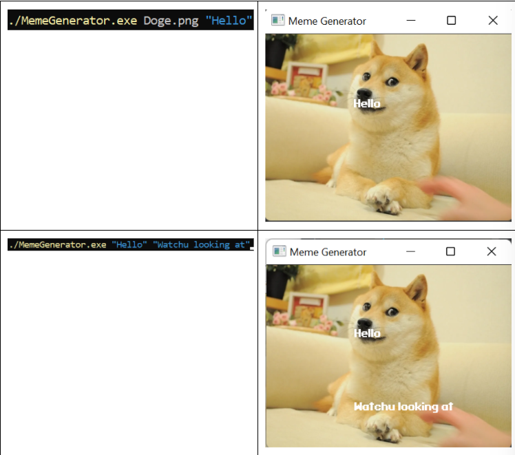
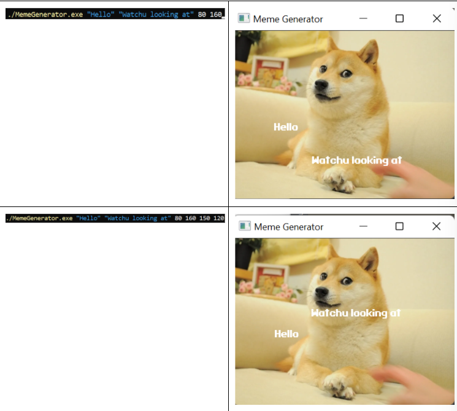

# MemeGenerator
An meme generating program that takes in a picture file and up to two phrases with specified location via command line arguments. Created with SFML library

# Downloading and setting up SFML:
### First we have to down the correct version of SFML, at https://www.sfml-dev.org/download/sfml/2.5.1/ then set up the following environmental variables, with PATH being C:\Libraries\SFML-2.5.1\bin  and SFML_INSTALL being C:\Libraries\SFML-2.5.1

### When downloading the SFML, make sure that the SFML-2.5.1 is in the Libraries folder in your base directory of your computer. You can even modify the environment variable to match your needs, just make sure that the path matches!

# The file structure:

#Sample inputs and outputs

